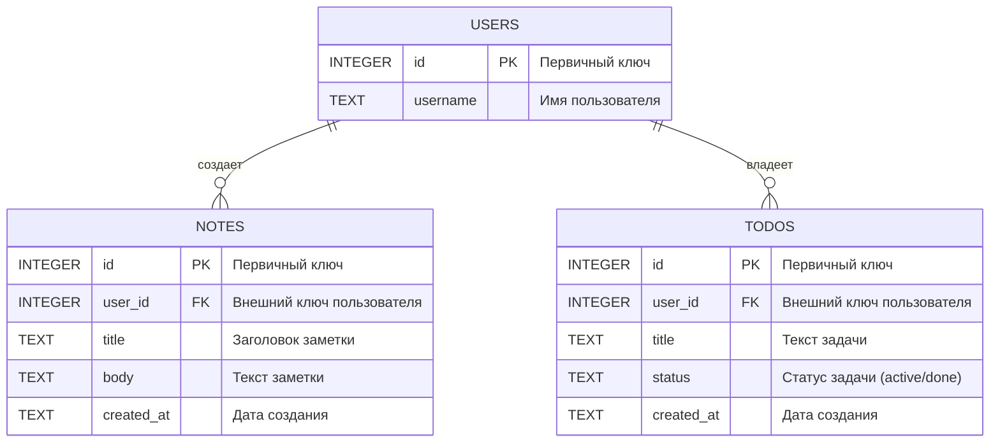

# ER-диаграмма

## Описание

ER-диаграмма описывает основные сущности и связи предметной области проекта "Todo & Notes".

## Сущности

- `USERS` — пользователи системы.
- `NOTES` — заметки, связанные с пользователем.
- `TODOS` — задачи, связанные с пользователем.

## Связи

- Один пользователь может создавать несколько заметок.
- Один пользователь может иметь несколько задач.
