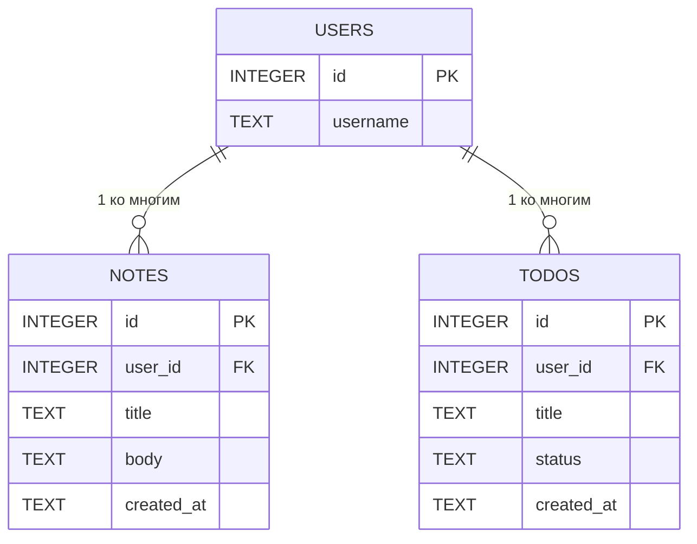

# Логическая схема базы данных

## Описание

Логическая схема отражает структуру таблиц базы данных и ключевые связи между ними.

## Таблицы и поля

- `USERS`
    - `id` — PK
    - `username`

- `NOTES`
    - `id` — PK
    - `user_id` — FK на `USERS(id)`
    - `title`
    - `body`
    - `created_at`

- `TODOS`
    - `id` — PK
    - `user_id` — FK на `USERS(id)`
    - `title`
    - `status`
    - `created_at`

## Связи

- Пользователь может иметь несколько заметок.
- Пользователь может иметь несколько задач.
- Каждая заметка и задача принадлежит одному пользователю.
